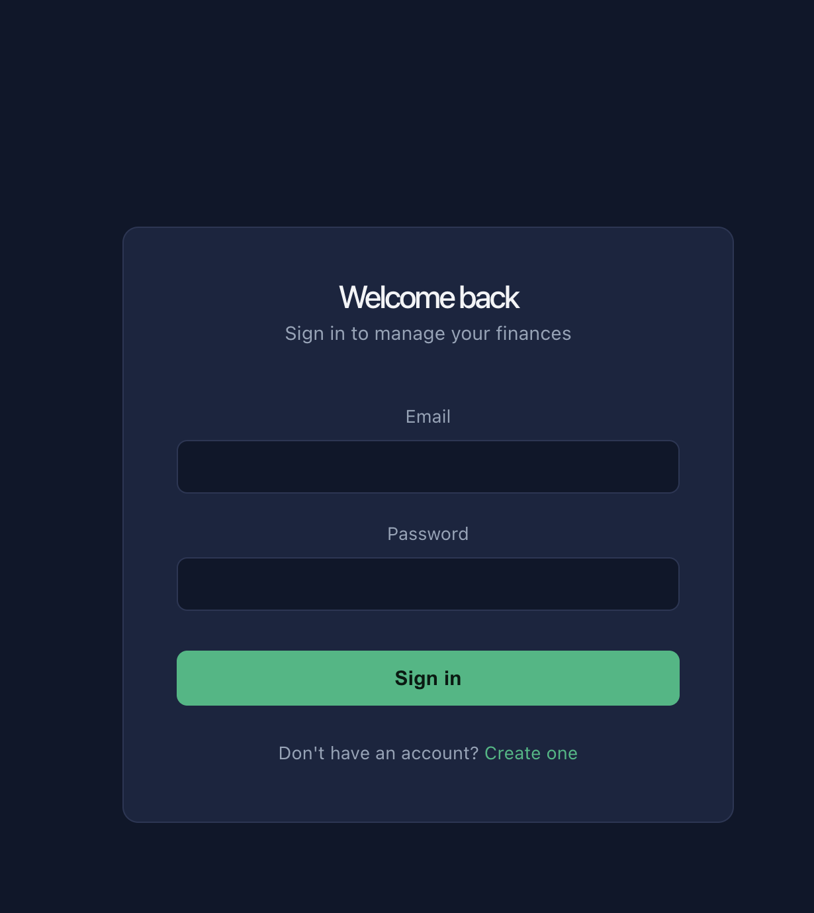
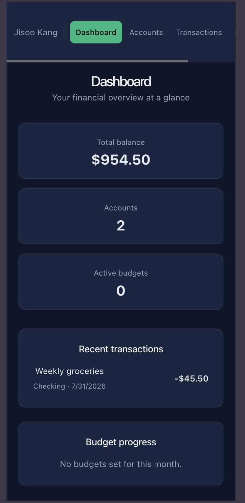

# Personal Finance Tracker — Web

A full-featured, responsive React frontend for tracking personal finances — connects to a secure ASP.NET Core API with JWT authentication, Azure Blob Storage receipt uploads, and role-based access control.

Built as a portfolio project to pair with a real, working backend (not a mock/demo API), demonstrating a complete full-stack banking-style application.

## Features

- **Authentication** — Register/login with persistent sessions and protected routing
- **Dashboard** — At-a-glance summary: total balance, account count, recent transactions, live budget progress
- **Accounts** — Create and manage multiple accounts (Checking, Savings, etc.)
- **Transactions** — Log income/expenses with category and account selection, upload receipt images, view receipts via secure time-limited links
- **Budgets** — Set monthly spending limits per category with month/year filtering and visual progress bars
- **Profile Photo** — Upload and display a personal avatar, stored securely in Azure Blob Storage
- **Responsive Design** — Fully functional mobile layout, not just a scaled-down desktop view
- **Loading & Error States** — Skeleton loaders and specific, actionable error messages throughout

## Tech Stack

| Layer | Technology |
|---|---|
| Framework | React 18 + TypeScript |
| Build tool | Vite |
| Routing | React Router |
| HTTP client | Axios |
| State | React Context (Auth) |
| Styling | Plain CSS with custom properties (no framework) |

## Architecture Highlights

- **Typed API layer** — every backend call is wrapped in a typed function (`src/api/`), with TypeScript interfaces mirroring the backend's DTOs exactly, catching integration bugs at compile time rather than runtime
- **Centralized auth handling** — a single Axios interceptor attaches the JWT to every request and handles token expiry globally, so individual pages never manage authentication headers themselves
- **Protected routing** — unauthenticated users are automatically redirected to `/login`, enforced via a reusable `<ProtectedRoute>` wrapper
- **Secure file handling** — receipt and profile photo uploads use `multipart/form-data`; viewing goes through the backend's SAS-token endpoint rather than storing or guessing public URLs

## Getting Started

### Prerequisites
- Node.js 18+
- The [backend API](https://github.com/JisooKang03/personal-finance-tracker-api) running locally (or update the API base URL in `src/api/client.ts`)

### Setup

1. Clone the repo:
```bash
   git clone https://github.com/JisooKang03/personal-finance-tracker-web.git
   cd personal-finance-tracker-web
```

2. Install dependencies:
```bash
   npm install
```

3. Run the dev server:
```bash
   npm run dev
```

4. Open `http://localhost:5173`

## Screenshots

### Login


### Dashboard


### Accounts


### Transactions (with receipt upload/view)


### Budgets


### Mobile / Responsive Layout


## Related Repo

Backend API: [personal-finance-tracker-api](https://github.com/JisooKang03/personal-finance-tracker-api)
